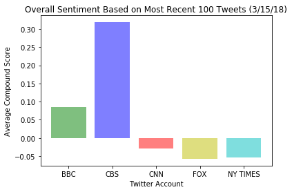

In this assignment, you'll create a Python script to perform a sentiment analysis of the Twitter activity of various news oulets, and to present your findings visually.

Your final output should provide a visualized summary of the sentiments expressed in Tweets sent out by the following news organizations: __BBC, CBS, CNN, Fox, and New York times__.


The first plot will be and/or feature the following:

* Be a scatter plot of sentiments of the last __100__ tweets sent out by each news organization, ranging from -1.0 to 1.0, where a score of 0 expresses a neutral sentiment, -1 the most negative sentiment possible, and +1 the most positive sentiment possible.
* Each plot point will reflect the _compound_ sentiment of a tweet.
* Sort each plot point by its relative timestamp.

The second plot will be a bar plot visualizing the _overall_ sentiments of the last 100 tweets from each organization. For this plot, you will again aggregate the compound sentiments analyzed by VADER.

The tools of the trade you will need for your task as a data analyst include the following: tweepy, pandas, matplotlib, and VADER.

Your final Jupyter notebook must:

* Pull last 100 tweets from each outlet.
* Perform a sentiment analysis with the compound, positive, neutral, and negative scoring for each tweet. 
* Pull into a DataFrame the tweet's source acount, its text, its date, and its compound, positive, neutral, and negative sentiment scores.
* Export the data in the DataFrame into a CSV file.
* Save PNG images for each plot.

As final considerations:

* Use the Matplotlib libraries.
* Include a written description of three observable trends based on the data. 
* Include proper labeling of your plots, including plot titles (with date of analysis) and axes labels.
* Include an exported markdown version of your Notebook called  `README.md` in your GitHub repository.  


```python
# Dependencies
import tweepy
import json
from pprint import pprint
import matplotlib.pyplot as plt
import numpy as np
from config import consumer_key, consumer_secret, access_token, access_token_secret
from vaderSentiment.vaderSentiment import SentimentIntensityAnalyzer
analyzer = SentimentIntensityAnalyzer()
import pandas as pd
from datetime import datetime

# Setup Tweepy API Authentication
auth = tweepy.OAuthHandler(consumer_key, consumer_secret)
auth.set_access_token(access_token, access_token_secret)
api = tweepy.API(auth, parser=tweepy.parsers.JSONParser())
```


```python
# reference target accounts and pull in the last 100 tweets for each
# pull in source account, text, and date
target_accounts = ("@BBC", "@CBS", "@CNN",
                    "@FoxNews", "@nytimes")

#create arrays for text and date
tweet_text = []
tweet_dates = []
user = []
compound_list = []
positive_list = []
negative_list = []
neutral_list = []

# loop through the accounts
for target in target_accounts:
    

    #100 tweets per user account
    for x in range(5):
    
        # Get all tweets from home feed (for each page specified)
        public_tweets = api.user_timeline(target, result_type="recent", page=x)
        
        
        # Loop through the tweets
        for tweet in public_tweets:

            
            # Run Vader Analysis on each tweet
            results = analyzer.polarity_scores(tweet["text"])
            compound = results["compound"]
            pos = results["pos"]
            neu = results["neu"]
            neg = results["neg"]
            
            # Append results to the arrays
            tweet_text.append(tweet["text"])
            tweet_dates.append(tweet["created_at"])
            user.append(target)
            compound_list.append(compound)
            positive_list.append(pos)
            negative_list.append(neg)
            neutral_list.append(neu)
            
```


```python
# Convert tweet timestamps to datetime objects
converted_timestamps = []
for tweet_date in tweet_dates:
    converted_time = datetime.strptime(tweet_date, "%a %b %d %H:%M:%S %z %Y")
    converted_timestamps.append(converted_time)
print(converted_timestamps)

print(len(converted_timestamps))
```

    [datetime.datetime(2018, 3, 15, 17, 30, 5, tzinfo=datetime.timezone.utc), datetime.datetime(2018, 3, 15, 13, 52, 24, tzinfo=datetime.timezone.utc), datetime.datetime(2018, 3, 15, 13, 0, 5, tzinfo=datetime.timezone.utc), datetime.datetime(2018, 3, 15, 12, 0, 16, tzinfo=datetime.timezone.utc), datetime.datetime(2018, 3, 15, 10, 45, tzinfo=datetime.timezone.utc), datetime.datetime(2018, 3, 15, 10, 26, 48, tzinfo=datetime.timezone.utc), datetime.datetime(2018, 3, 15, 9, 53, 48, tzinfo=datetime.timezone.utc), datetime.datetime(2018, 3, 15, 9, 53, 11, tzinfo=datetime.timezone.utc), datetime.datetime(2018, 3, 15, 9, 50, 25, tzinfo=datetime.timezone.utc), datetime.datetime(2018, 3, 15, 9, 0, 8, tzinfo=datetime.timezone.utc), datetime.datetime(2018, 3, 15, 8, 30, 8, tzinfo=datetime.timezone.utc), datetime.datetime(2018, 3, 15, 8, 0, 4, tzinfo=datetime.timezone.utc), datetime.datetime(2018, 3, 14, 21, 14, 4, tzinfo=datetime.timezone.utc), datetime.datetime(2018, 3, 14, 20, 0, 3, tzinfo=datetime.timezone.utc), datetime.datetime(2018, 3, 14, 19, 10, tzinfo=datetime.timezone.utc), datetime.datetime(2018, 3, 14, 19, 4, 3, tzinfo=datetime.timezone.utc), datetime.datetime(2018, 3, 14, 18, 30, tzinfo=datetime.timezone.utc), datetime.datetime(2018, 3, 14, 17, 30, tzinfo=datetime.timezone.utc), datetime.datetime(2018, 3, 14, 16, 43, 32, tzinfo=datetime.timezone.utc), datetime.datetime(2018, 3, 14, 16, 20, 43, tzinfo=datetime.timezone.utc), datetime.datetime(2018, 3, 15, 17, 30, 5, tzinfo=datetime.timezone.utc), datetime.datetime(2018, 3, 15, 13, 52, 24, tzinfo=datetime.timezone.utc), datetime.datetime(2018, 3, 15, 13, 0, 5, tzinfo=datetime.timezone.utc), datetime.datetime(2018, 3, 15, 12, 0, 16, tzinfo=datetime.timezone.utc), datetime.datetime(2018, 3, 15, 10, 45, tzinfo=datetime.timezone.utc), datetime.datetime(2018, 3, 15, 10, 26, 48, tzinfo=datetime.timezone.utc), datetime.datetime(2018, 3, 15, 9, 53, 48, tzinfo=datetime.timezone.utc), datetime.datetime(2018, 3, 15, 9, 53, 11, tzinfo=datetime.timezone.utc), datetime.datetime(2018, 3, 15, 9, 50, 25, tzinfo=datetime.timezone.utc), datetime.datetime(2018, 3, 15, 9, 0, 8, tzinfo=datetime.timezone.utc), datetime.datetime(2018, 3, 15, 8, 30, 8, tzinfo=datetime.timezone.utc), datetime.datetime(2018, 3, 15, 8, 0, 4, tzinfo=datetime.timezone.utc), datetime.datetime(2018, 3, 14, 21, 14, 4, tzinfo=datetime.timezone.utc), datetime.datetime(2018, 3, 14, 20, 0, 3, tzinfo=datetime.timezone.utc), datetime.datetime(2018, 3, 14, 19, 10, tzinfo=datetime.timezone.utc), datetime.datetime(2018, 3, 14, 19, 4, 3, tzinfo=datetime.timezone.utc), datetime.datetime(2018, 3, 14, 18, 30, tzinfo=datetime.timezone.utc), datetime.datetime(2018, 3, 14, 17, 30, tzinfo=datetime.timezone.utc), datetime.datetime(2018, 3, 14, 16, 43, 32, tzinfo=datetime.timezone.utc), datetime.datetime(2018, 3, 14, 16, 20, 43, tzinfo=datetime.timezone.utc), datetime.datetime(2018, 3, 14, 14, 38, 4, tzinfo=datetime.timezone.utc), datetime.datetime(2018, 3, 14, 13, 24, 10, tzinfo=datetime.timezone.utc), datetime.datetime(2018, 3, 14, 13, 0, 6, tzinfo=datetime.timezone.utc), datetime.datetime(2018, 3, 14, 12, 49, 48, tzinfo=datetime.timezone.utc), datetime.datetime(2018, 3, 14, 12, 17, 18, tzinfo=datetime.timezone.utc), datetime.datetime(2018, 3, 14, 12, 12, 32, tzinfo=datetime.timezone.utc), datetime.datetime(2018, 3, 14, 12, 3, 5, tzinfo=datetime.timezone.utc), datetime.datetime(2018, 3, 14, 11, 59, 37, tzinfo=datetime.timezone.utc), datetime.datetime(2018, 3, 14, 11, 56, 23, tzinfo=datetime.timezone.utc), datetime.datetime(2018, 3, 14, 11, 56, 14, tzinfo=datetime.timezone.utc), datetime.datetime(2018, 3, 14, 11, 30, 12, tzinfo=datetime.timezone.utc), datetime.datetime(2018, 3, 14, 10, 27, 40, tzinfo=datetime.timezone.utc), datetime.datetime(2018, 3, 14, 10, 1, 19, tzinfo=datetime.timezone.utc), datetime.datetime(2018, 3, 14, 9, 0, 5, tzinfo=datetime.timezone.utc), datetime.datetime(2018, 3, 14, 8, 35, 41, tzinfo=datetime.timezone.utc), datetime.datetime(2018, 3, 14, 7, 7, 28, tzinfo=datetime.timezone.utc), datetime.datetime(2018, 3, 14, 7, 3, 36, tzinfo=datetime.timezone.utc), datetime.datetime(2018, 3, 14, 6, 28, 18, tzinfo=datetime.timezone.utc), datetime.datetime(2018, 3, 14, 6, 21, 50, tzinfo=datetime.timezone.utc), datetime.datetime(2018, 3, 13, 20, 0, 5, tzinfo=datetime.timezone.utc), datetime.datetime(2018, 3, 13, 19, 0, 5, tzinfo=datetime.timezone.utc), datetime.datetime(2018, 3, 13, 18, 30, 5, tzinfo=datetime.timezone.utc), datetime.datetime(2018, 3, 13, 17, 30, 6, tzinfo=datetime.timezone.utc), datetime.datetime(2018, 3, 13, 17, 16, 46, tzinfo=datetime.timezone.utc), datetime.datetime(2018, 3, 13, 17, 13, 13, tzinfo=datetime.timezone.utc), datetime.datetime(2018, 3, 13, 17, 2, 28, tzinfo=datetime.timezone.utc), datetime.datetime(2018, 3, 13, 14, 0, 22, tzinfo=datetime.timezone.utc), datetime.datetime(2018, 3, 13, 13, 0, 8, tzinfo=datetime.timezone.utc), datetime.datetime(2018, 3, 13, 12, 26, 59, tzinfo=datetime.timezone.utc), datetime.datetime(2018, 3, 13, 12, 3, 24, tzinfo=datetime.timezone.utc), datetime.datetime(2018, 3, 13, 12, 0, 9, tzinfo=datetime.timezone.utc), datetime.datetime(2018, 3, 13, 11, 28, 9, tzinfo=datetime.timezone.utc), datetime.datetime(2018, 3, 13, 11, 26, 58, tzinfo=datetime.timezone.utc), datetime.datetime(2018, 3, 13, 9, 0, 6, tzinfo=datetime.timezone.utc), datetime.datetime(2018, 3, 13, 8, 30, 7, tzinfo=datetime.timezone.utc), datetime.datetime(2018, 3, 13, 8, 0, 3, tzinfo=datetime.timezone.utc), datetime.datetime(2018, 3, 12, 20, 17, 27, tzinfo=datetime.timezone.utc), datetime.datetime(2018, 3, 12, 20, 16, 22, tzinfo=datetime.timezone.utc), datetime.datetime(2018, 3, 12, 19, 23, 1, tzinfo=datetime.timezone.utc), datetime.datetime(2018, 3, 12, 18, 30, 6, tzinfo=datetime.timezone.utc), datetime.datetime(2018, 3, 12, 17, 30, 5, tzinfo=datetime.timezone.utc), datetime.datetime(2018, 3, 12, 16, 44, 15, tzinfo=datetime.timezone.utc), datetime.datetime(2018, 3, 12, 16, 24, 52, tzinfo=datetime.timezone.utc), datetime.datetime(2018, 3, 12, 16, 17, 43, tzinfo=datetime.timezone.utc), datetime.datetime(2018, 3, 12, 16, 7, 16, tzinfo=datetime.timezone.utc), datetime.datetime(2018, 3, 12, 15, 55, 51, tzinfo=datetime.timezone.utc), datetime.datetime(2018, 3, 12, 14, 0, 9, tzinfo=datetime.timezone.utc), datetime.datetime(2018, 3, 12, 13, 30, 45, tzinfo=datetime.timezone.utc), datetime.datetime(2018, 3, 12, 13, 27, 27, tzinfo=datetime.timezone.utc), datetime.datetime(2018, 3, 12, 12, 59, 5, tzinfo=datetime.timezone.utc), datetime.datetime(2018, 3, 12, 12, 46, 6, tzinfo=datetime.timezone.utc), datetime.datetime(2018, 3, 12, 12, 40, 39, tzinfo=datetime.timezone.utc), datetime.datetime(2018, 3, 12, 12, 19, 24, tzinfo=datetime.timezone.utc), datetime.datetime(2018, 3, 12, 12, 0, 9, tzinfo=datetime.timezone.utc), datetime.datetime(2018, 3, 12, 10, 58, 16, tzinfo=datetime.timezone.utc), datetime.datetime(2018, 3, 12, 10, 55, 19, tzinfo=datetime.timezone.utc), datetime.datetime(2018, 3, 12, 10, 52, 55, tzinfo=datetime.timezone.utc), datetime.datetime(2018, 3, 12, 9, 58, 30, tzinfo=datetime.timezone.utc), datetime.datetime(2018, 3, 12, 9, 0, 6, tzinfo=datetime.timezone.utc), datetime.datetime(2018, 3, 12, 8, 30, 4, tzinfo=datetime.timezone.utc), datetime.datetime(2018, 3, 15, 17, 54, 6, tzinfo=datetime.timezone.utc), datetime.datetime(2018, 3, 15, 17, 20, 26, tzinfo=datetime.timezone.utc), datetime.datetime(2018, 3, 15, 16, 42, 41, tzinfo=datetime.timezone.utc), datetime.datetime(2018, 3, 15, 14, 32, 16, tzinfo=datetime.timezone.utc), datetime.datetime(2018, 3, 14, 19, 30, 1, tzinfo=datetime.timezone.utc), datetime.datetime(2018, 3, 13, 18, 48, 52, tzinfo=datetime.timezone.utc), datetime.datetime(2018, 3, 13, 14, 15, 10, tzinfo=datetime.timezone.utc), datetime.datetime(2018, 3, 12, 18, 13, 28, tzinfo=datetime.timezone.utc), datetime.datetime(2018, 3, 12, 1, 20, 43, tzinfo=datetime.timezone.utc), datetime.datetime(2018, 3, 9, 22, 48, 26, tzinfo=datetime.timezone.utc), datetime.datetime(2018, 3, 9, 22, 24, 20, tzinfo=datetime.timezone.utc), datetime.datetime(2018, 3, 9, 21, 10, 21, tzinfo=datetime.timezone.utc), datetime.datetime(2018, 3, 9, 18, 27, 28, tzinfo=datetime.timezone.utc), datetime.datetime(2018, 3, 9, 16, 2, 27, tzinfo=datetime.timezone.utc), datetime.datetime(2018, 3, 8, 18, 0, 49, tzinfo=datetime.timezone.utc), datetime.datetime(2018, 3, 8, 17, 3, 4, tzinfo=datetime.timezone.utc), datetime.datetime(2018, 3, 7, 18, 39, 10, tzinfo=datetime.timezone.utc), datetime.datetime(2018, 3, 7, 17, 6, 2, tzinfo=datetime.timezone.utc), datetime.datetime(2018, 3, 6, 18, 10, 59, tzinfo=datetime.timezone.utc), datetime.datetime(2018, 3, 5, 22, 16, 43, tzinfo=datetime.timezone.utc), datetime.datetime(2018, 3, 15, 17, 54, 6, tzinfo=datetime.timezone.utc), datetime.datetime(2018, 3, 15, 17, 20, 26, tzinfo=datetime.timezone.utc), datetime.datetime(2018, 3, 15, 16, 42, 41, tzinfo=datetime.timezone.utc), datetime.datetime(2018, 3, 15, 14, 32, 16, tzinfo=datetime.timezone.utc), datetime.datetime(2018, 3, 14, 19, 30, 1, tzinfo=datetime.timezone.utc), datetime.datetime(2018, 3, 13, 18, 48, 52, tzinfo=datetime.timezone.utc), datetime.datetime(2018, 3, 13, 14, 15, 10, tzinfo=datetime.timezone.utc), datetime.datetime(2018, 3, 12, 18, 13, 28, tzinfo=datetime.timezone.utc), datetime.datetime(2018, 3, 12, 1, 20, 43, tzinfo=datetime.timezone.utc), datetime.datetime(2018, 3, 9, 22, 48, 26, tzinfo=datetime.timezone.utc), datetime.datetime(2018, 3, 9, 22, 24, 20, tzinfo=datetime.timezone.utc), datetime.datetime(2018, 3, 9, 21, 10, 21, tzinfo=datetime.timezone.utc), datetime.datetime(2018, 3, 9, 18, 27, 28, tzinfo=datetime.timezone.utc), datetime.datetime(2018, 3, 9, 16, 2, 27, tzinfo=datetime.timezone.utc), datetime.datetime(2018, 3, 8, 18, 0, 49, tzinfo=datetime.timezone.utc), datetime.datetime(2018, 3, 8, 17, 3, 4, tzinfo=datetime.timezone.utc), datetime.datetime(2018, 3, 7, 18, 39, 10, tzinfo=datetime.timezone.utc), datetime.datetime(2018, 3, 7, 17, 6, 2, tzinfo=datetime.timezone.utc), datetime.datetime(2018, 3, 6, 18, 10, 59, tzinfo=datetime.timezone.utc), datetime.datetime(2018, 3, 5, 22, 16, 43, tzinfo=datetime.timezone.utc), datetime.datetime(2018, 3, 4, 8, 5, 26, tzinfo=datetime.timezone.utc), datetime.datetime(2018, 3, 3, 20, 55, 20, tzinfo=datetime.timezone.utc), datetime.datetime(2018, 3, 2, 22, 30, 1, tzinfo=datetime.timezone.utc), datetime.datetime(2018, 3, 2, 20, 30, 1, tzinfo=datetime.timezone.utc), datetime.datetime(2018, 3, 2, 18, 45, tzinfo=datetime.timezone.utc), datetime.datetime(2018, 3, 1, 18, 59, 1, tzinfo=datetime.timezone.utc), datetime.datetime(2018, 3, 1, 18, 12, 57, tzinfo=datetime.timezone.utc), datetime.datetime(2018, 3, 1, 18, 11, 50, tzinfo=datetime.timezone.utc), datetime.datetime(2018, 3, 1, 18, 10, 50, tzinfo=datetime.timezone.utc), datetime.datetime(2018, 3, 1, 14, 36, 21, tzinfo=datetime.timezone.utc), datetime.datetime(2018, 3, 1, 14, 29, 20, tzinfo=datetime.timezone.utc), datetime.datetime(2018, 3, 1, 14, 15, 29, tzinfo=datetime.timezone.utc), datetime.datetime(2018, 3, 1, 13, 50, 11, tzinfo=datetime.timezone.utc), datetime.datetime(2018, 3, 1, 1, 4, 52, tzinfo=datetime.timezone.utc), datetime.datetime(2018, 2, 28, 19, 56, 58, tzinfo=datetime.timezone.utc), datetime.datetime(2018, 2, 28, 19, 8, 30, tzinfo=datetime.timezone.utc), datetime.datetime(2018, 2, 27, 3, 23, 47, tzinfo=datetime.timezone.utc), datetime.datetime(2018, 2, 26, 22, 50, 32, tzinfo=datetime.timezone.utc), datetime.datetime(2018, 2, 26, 21, 8, 30, tzinfo=datetime.timezone.utc), datetime.datetime(2018, 2, 26, 19, 53, 41, tzinfo=datetime.timezone.utc), datetime.datetime(2018, 2, 26, 18, 32, 36, tzinfo=datetime.timezone.utc), datetime.datetime(2018, 2, 26, 18, 20, 16, tzinfo=datetime.timezone.utc), datetime.datetime(2018, 2, 26, 16, 53, 56, tzinfo=datetime.timezone.utc), datetime.datetime(2018, 2, 26, 16, 52, 1, tzinfo=datetime.timezone.utc), datetime.datetime(2018, 2, 26, 16, 17, 55, tzinfo=datetime.timezone.utc), datetime.datetime(2018, 2, 26, 1, 12, 32, tzinfo=datetime.timezone.utc), datetime.datetime(2018, 2, 25, 21, 51, 32, tzinfo=datetime.timezone.utc), datetime.datetime(2018, 2, 25, 21, 51, 22, tzinfo=datetime.timezone.utc), datetime.datetime(2018, 2, 23, 18, 15, 40, tzinfo=datetime.timezone.utc), datetime.datetime(2018, 2, 22, 19, 26, 52, tzinfo=datetime.timezone.utc), datetime.datetime(2018, 2, 21, 19, 20, 4, tzinfo=datetime.timezone.utc), datetime.datetime(2018, 2, 21, 18, 19, 25, tzinfo=datetime.timezone.utc), datetime.datetime(2018, 2, 20, 19, 55, 19, tzinfo=datetime.timezone.utc), datetime.datetime(2018, 2, 20, 17, 58, 18, tzinfo=datetime.timezone.utc), datetime.datetime(2018, 2, 20, 17, 39, 51, tzinfo=datetime.timezone.utc), datetime.datetime(2018, 2, 17, 1, 7, 20, tzinfo=datetime.timezone.utc), datetime.datetime(2018, 2, 16, 18, 42, 43, tzinfo=datetime.timezone.utc), datetime.datetime(2018, 2, 16, 17, 48, 20, tzinfo=datetime.timezone.utc), datetime.datetime(2018, 2, 14, 19, 23, 27, tzinfo=datetime.timezone.utc), datetime.datetime(2018, 2, 13, 20, 3, 56, tzinfo=datetime.timezone.utc), datetime.datetime(2018, 2, 13, 18, 54, 52, tzinfo=datetime.timezone.utc), datetime.datetime(2018, 2, 12, 18, 49, 45, tzinfo=datetime.timezone.utc), datetime.datetime(2018, 2, 12, 1, 32, 33, tzinfo=datetime.timezone.utc), datetime.datetime(2018, 2, 9, 0, 50, 1, tzinfo=datetime.timezone.utc), datetime.datetime(2018, 2, 8, 16, 9, 35, tzinfo=datetime.timezone.utc), datetime.datetime(2018, 2, 7, 18, 35, 19, tzinfo=datetime.timezone.utc), datetime.datetime(2018, 2, 7, 16, 17, 48, tzinfo=datetime.timezone.utc), datetime.datetime(2018, 2, 6, 22, 21, 39, tzinfo=datetime.timezone.utc), datetime.datetime(2018, 2, 6, 17, 5, 49, tzinfo=datetime.timezone.utc), datetime.datetime(2018, 2, 4, 15, 35, 36, tzinfo=datetime.timezone.utc), datetime.datetime(2018, 2, 4, 12, 0, 1, tzinfo=datetime.timezone.utc), datetime.datetime(2018, 2, 3, 23, 11, 43, tzinfo=datetime.timezone.utc), datetime.datetime(2018, 2, 3, 12, 0, 7, tzinfo=datetime.timezone.utc), datetime.datetime(2018, 2, 2, 22, 36, 13, tzinfo=datetime.timezone.utc), datetime.datetime(2018, 2, 2, 20, 7, 40, tzinfo=datetime.timezone.utc), datetime.datetime(2018, 2, 2, 19, 3, 33, tzinfo=datetime.timezone.utc), datetime.datetime(2018, 2, 2, 17, 23, 18, tzinfo=datetime.timezone.utc), datetime.datetime(2018, 2, 1, 22, 4, 41, tzinfo=datetime.timezone.utc), datetime.datetime(2018, 2, 1, 20, 9, 49, tzinfo=datetime.timezone.utc), datetime.datetime(2018, 1, 31, 21, 42, 15, tzinfo=datetime.timezone.utc), datetime.datetime(2018, 3, 15, 18, 15, 11, tzinfo=datetime.timezone.utc), datetime.datetime(2018, 3, 15, 18, 7, 52, tzinfo=datetime.timezone.utc), datetime.datetime(2018, 3, 15, 18, 5, 5, tzinfo=datetime.timezone.utc), datetime.datetime(2018, 3, 15, 17, 56, 46, tzinfo=datetime.timezone.utc), datetime.datetime(2018, 3, 15, 17, 55, 8, tzinfo=datetime.timezone.utc), datetime.datetime(2018, 3, 15, 17, 43, 5, tzinfo=datetime.timezone.utc), datetime.datetime(2018, 3, 15, 17, 33, 44, tzinfo=datetime.timezone.utc), datetime.datetime(2018, 3, 15, 17, 12, 6, tzinfo=datetime.timezone.utc), datetime.datetime(2018, 3, 15, 17, 2, 57, tzinfo=datetime.timezone.utc), datetime.datetime(2018, 3, 15, 16, 50, 4, tzinfo=datetime.timezone.utc), datetime.datetime(2018, 3, 15, 16, 40, 12, tzinfo=datetime.timezone.utc), datetime.datetime(2018, 3, 15, 16, 35, 8, tzinfo=datetime.timezone.utc), datetime.datetime(2018, 3, 15, 16, 26, 14, tzinfo=datetime.timezone.utc), datetime.datetime(2018, 3, 15, 16, 10, 16, tzinfo=datetime.timezone.utc), datetime.datetime(2018, 3, 15, 16, 0, 14, tzinfo=datetime.timezone.utc), datetime.datetime(2018, 3, 15, 15, 50, 11, tzinfo=datetime.timezone.utc), datetime.datetime(2018, 3, 15, 15, 40, 15, tzinfo=datetime.timezone.utc), datetime.datetime(2018, 3, 15, 15, 30, 10, tzinfo=datetime.timezone.utc), datetime.datetime(2018, 3, 15, 15, 20, 13, tzinfo=datetime.timezone.utc), datetime.datetime(2018, 3, 15, 15, 20, 7, tzinfo=datetime.timezone.utc), datetime.datetime(2018, 3, 15, 18, 15, 11, tzinfo=datetime.timezone.utc), datetime.datetime(2018, 3, 15, 18, 7, 52, tzinfo=datetime.timezone.utc), datetime.datetime(2018, 3, 15, 18, 5, 5, tzinfo=datetime.timezone.utc), datetime.datetime(2018, 3, 15, 17, 56, 46, tzinfo=datetime.timezone.utc), datetime.datetime(2018, 3, 15, 17, 55, 8, tzinfo=datetime.timezone.utc), datetime.datetime(2018, 3, 15, 17, 43, 5, tzinfo=datetime.timezone.utc), datetime.datetime(2018, 3, 15, 17, 33, 44, tzinfo=datetime.timezone.utc), datetime.datetime(2018, 3, 15, 17, 12, 6, tzinfo=datetime.timezone.utc), datetime.datetime(2018, 3, 15, 17, 2, 57, tzinfo=datetime.timezone.utc), datetime.datetime(2018, 3, 15, 16, 50, 4, tzinfo=datetime.timezone.utc), datetime.datetime(2018, 3, 15, 16, 40, 12, tzinfo=datetime.timezone.utc), datetime.datetime(2018, 3, 15, 16, 35, 8, tzinfo=datetime.timezone.utc), datetime.datetime(2018, 3, 15, 16, 26, 14, tzinfo=datetime.timezone.utc), datetime.datetime(2018, 3, 15, 16, 10, 16, tzinfo=datetime.timezone.utc), datetime.datetime(2018, 3, 15, 16, 0, 14, tzinfo=datetime.timezone.utc), datetime.datetime(2018, 3, 15, 15, 50, 11, tzinfo=datetime.timezone.utc), datetime.datetime(2018, 3, 15, 15, 40, 15, tzinfo=datetime.timezone.utc), datetime.datetime(2018, 3, 15, 15, 30, 10, tzinfo=datetime.timezone.utc), datetime.datetime(2018, 3, 15, 15, 20, 13, tzinfo=datetime.timezone.utc), datetime.datetime(2018, 3, 15, 15, 20, 7, tzinfo=datetime.timezone.utc), datetime.datetime(2018, 3, 15, 15, 10, 8, tzinfo=datetime.timezone.utc), datetime.datetime(2018, 3, 15, 15, 0, 22, tzinfo=datetime.timezone.utc), datetime.datetime(2018, 3, 15, 14, 50, 10, tzinfo=datetime.timezone.utc), datetime.datetime(2018, 3, 15, 14, 42, 19, tzinfo=datetime.timezone.utc), datetime.datetime(2018, 3, 15, 14, 39, 12, tzinfo=datetime.timezone.utc), datetime.datetime(2018, 3, 15, 14, 20, 28, tzinfo=datetime.timezone.utc), datetime.datetime(2018, 3, 15, 14, 10, 9, tzinfo=datetime.timezone.utc), datetime.datetime(2018, 3, 15, 14, 0, 11, tzinfo=datetime.timezone.utc), datetime.datetime(2018, 3, 15, 13, 50, 9, tzinfo=datetime.timezone.utc), datetime.datetime(2018, 3, 15, 13, 40, 9, tzinfo=datetime.timezone.utc), datetime.datetime(2018, 3, 15, 13, 30, 11, tzinfo=datetime.timezone.utc), datetime.datetime(2018, 3, 15, 13, 25, 7, tzinfo=datetime.timezone.utc), datetime.datetime(2018, 3, 15, 13, 17, 48, tzinfo=datetime.timezone.utc), datetime.datetime(2018, 3, 15, 13, 6, 8, tzinfo=datetime.timezone.utc), datetime.datetime(2018, 3, 15, 12, 43, tzinfo=datetime.timezone.utc), datetime.datetime(2018, 3, 15, 12, 34, 1, tzinfo=datetime.timezone.utc), datetime.datetime(2018, 3, 15, 12, 27, tzinfo=datetime.timezone.utc), datetime.datetime(2018, 3, 15, 12, 2, 41, tzinfo=datetime.timezone.utc), datetime.datetime(2018, 3, 15, 11, 55, 10, tzinfo=datetime.timezone.utc), datetime.datetime(2018, 3, 15, 11, 44, 15, tzinfo=datetime.timezone.utc), datetime.datetime(2018, 3, 15, 11, 33, 30, tzinfo=datetime.timezone.utc), datetime.datetime(2018, 3, 15, 11, 32, 58, tzinfo=datetime.timezone.utc), datetime.datetime(2018, 3, 15, 11, 21, 3, tzinfo=datetime.timezone.utc), datetime.datetime(2018, 3, 15, 11, 10, 7, tzinfo=datetime.timezone.utc), datetime.datetime(2018, 3, 15, 11, 2, 14, tzinfo=datetime.timezone.utc), datetime.datetime(2018, 3, 15, 10, 50, 7, tzinfo=datetime.timezone.utc), datetime.datetime(2018, 3, 15, 10, 41, 7, tzinfo=datetime.timezone.utc), datetime.datetime(2018, 3, 15, 10, 30, 4, tzinfo=datetime.timezone.utc), datetime.datetime(2018, 3, 15, 10, 19, 3, tzinfo=datetime.timezone.utc), datetime.datetime(2018, 3, 15, 10, 11, 59, tzinfo=datetime.timezone.utc), datetime.datetime(2018, 3, 15, 9, 59, 3, tzinfo=datetime.timezone.utc), datetime.datetime(2018, 3, 15, 9, 54, 35, tzinfo=datetime.timezone.utc), datetime.datetime(2018, 3, 15, 9, 39, 30, tzinfo=datetime.timezone.utc), datetime.datetime(2018, 3, 15, 9, 7, 7, tzinfo=datetime.timezone.utc), datetime.datetime(2018, 3, 15, 8, 58, 4, tzinfo=datetime.timezone.utc), datetime.datetime(2018, 3, 15, 8, 41, 8, tzinfo=datetime.timezone.utc), datetime.datetime(2018, 3, 15, 8, 30, 3, tzinfo=datetime.timezone.utc), datetime.datetime(2018, 3, 15, 8, 21, 2, tzinfo=datetime.timezone.utc), datetime.datetime(2018, 3, 15, 8, 10, 6, tzinfo=datetime.timezone.utc), datetime.datetime(2018, 3, 15, 8, 1, tzinfo=datetime.timezone.utc), datetime.datetime(2018, 3, 15, 8, 0, 11, tzinfo=datetime.timezone.utc), datetime.datetime(2018, 3, 15, 7, 48, 3, tzinfo=datetime.timezone.utc), datetime.datetime(2018, 3, 15, 7, 37, 4, tzinfo=datetime.timezone.utc), datetime.datetime(2018, 3, 15, 7, 31, tzinfo=datetime.timezone.utc), datetime.datetime(2018, 3, 15, 7, 25, 6, tzinfo=datetime.timezone.utc), datetime.datetime(2018, 3, 15, 7, 17, 11, tzinfo=datetime.timezone.utc), datetime.datetime(2018, 3, 15, 7, 15, 14, tzinfo=datetime.timezone.utc), datetime.datetime(2018, 3, 15, 7, 14, 12, tzinfo=datetime.timezone.utc), datetime.datetime(2018, 3, 15, 7, 11, 5, tzinfo=datetime.timezone.utc), datetime.datetime(2018, 3, 15, 7, 1, 7, tzinfo=datetime.timezone.utc), datetime.datetime(2018, 3, 15, 7, 0, 24, tzinfo=datetime.timezone.utc), datetime.datetime(2018, 3, 15, 6, 31, 6, tzinfo=datetime.timezone.utc), datetime.datetime(2018, 3, 15, 6, 19, 48, tzinfo=datetime.timezone.utc), datetime.datetime(2018, 3, 15, 6, 1, 5, tzinfo=datetime.timezone.utc), datetime.datetime(2018, 3, 15, 5, 46, 7, tzinfo=datetime.timezone.utc), datetime.datetime(2018, 3, 15, 5, 31, 4, tzinfo=datetime.timezone.utc), datetime.datetime(2018, 3, 15, 5, 16, 5, tzinfo=datetime.timezone.utc), datetime.datetime(2018, 3, 15, 5, 1, 5, tzinfo=datetime.timezone.utc), datetime.datetime(2018, 3, 15, 4, 46, 4, tzinfo=datetime.timezone.utc), datetime.datetime(2018, 3, 15, 4, 31, 6, tzinfo=datetime.timezone.utc), datetime.datetime(2018, 3, 15, 18, 20, 13, tzinfo=datetime.timezone.utc), datetime.datetime(2018, 3, 15, 18, 18, 19, tzinfo=datetime.timezone.utc), datetime.datetime(2018, 3, 15, 18, 12, 48, tzinfo=datetime.timezone.utc), datetime.datetime(2018, 3, 15, 18, 2, 25, tzinfo=datetime.timezone.utc), datetime.datetime(2018, 3, 15, 18, 0, 34, tzinfo=datetime.timezone.utc), datetime.datetime(2018, 3, 15, 17, 58, 28, tzinfo=datetime.timezone.utc), datetime.datetime(2018, 3, 15, 17, 54, tzinfo=datetime.timezone.utc), datetime.datetime(2018, 3, 15, 17, 52, 45, tzinfo=datetime.timezone.utc), datetime.datetime(2018, 3, 15, 17, 44, 41, tzinfo=datetime.timezone.utc), datetime.datetime(2018, 3, 15, 17, 40, tzinfo=datetime.timezone.utc), datetime.datetime(2018, 3, 15, 17, 36, 40, tzinfo=datetime.timezone.utc), datetime.datetime(2018, 3, 15, 17, 34, 9, tzinfo=datetime.timezone.utc), datetime.datetime(2018, 3, 15, 17, 30, 24, tzinfo=datetime.timezone.utc), datetime.datetime(2018, 3, 15, 17, 27, 3, tzinfo=datetime.timezone.utc), datetime.datetime(2018, 3, 15, 17, 23, 5, tzinfo=datetime.timezone.utc), datetime.datetime(2018, 3, 15, 17, 21, 9, tzinfo=datetime.timezone.utc), datetime.datetime(2018, 3, 15, 17, 19, 5, tzinfo=datetime.timezone.utc), datetime.datetime(2018, 3, 15, 17, 11, 6, tzinfo=datetime.timezone.utc), datetime.datetime(2018, 3, 15, 17, 6, 13, tzinfo=datetime.timezone.utc), datetime.datetime(2018, 3, 15, 17, 1, 18, tzinfo=datetime.timezone.utc), datetime.datetime(2018, 3, 15, 18, 20, 13, tzinfo=datetime.timezone.utc), datetime.datetime(2018, 3, 15, 18, 18, 19, tzinfo=datetime.timezone.utc), datetime.datetime(2018, 3, 15, 18, 12, 48, tzinfo=datetime.timezone.utc), datetime.datetime(2018, 3, 15, 18, 2, 25, tzinfo=datetime.timezone.utc), datetime.datetime(2018, 3, 15, 18, 0, 34, tzinfo=datetime.timezone.utc), datetime.datetime(2018, 3, 15, 17, 58, 28, tzinfo=datetime.timezone.utc), datetime.datetime(2018, 3, 15, 17, 54, tzinfo=datetime.timezone.utc), datetime.datetime(2018, 3, 15, 17, 52, 45, tzinfo=datetime.timezone.utc), datetime.datetime(2018, 3, 15, 17, 44, 41, tzinfo=datetime.timezone.utc), datetime.datetime(2018, 3, 15, 17, 40, tzinfo=datetime.timezone.utc), datetime.datetime(2018, 3, 15, 17, 36, 40, tzinfo=datetime.timezone.utc), datetime.datetime(2018, 3, 15, 17, 34, 9, tzinfo=datetime.timezone.utc), datetime.datetime(2018, 3, 15, 17, 30, 24, tzinfo=datetime.timezone.utc), datetime.datetime(2018, 3, 15, 17, 27, 3, tzinfo=datetime.timezone.utc), datetime.datetime(2018, 3, 15, 17, 23, 5, tzinfo=datetime.timezone.utc), datetime.datetime(2018, 3, 15, 17, 21, 9, tzinfo=datetime.timezone.utc), datetime.datetime(2018, 3, 15, 17, 19, 5, tzinfo=datetime.timezone.utc), datetime.datetime(2018, 3, 15, 17, 11, 6, tzinfo=datetime.timezone.utc), datetime.datetime(2018, 3, 15, 17, 6, 13, tzinfo=datetime.timezone.utc), datetime.datetime(2018, 3, 15, 17, 1, 18, tzinfo=datetime.timezone.utc), datetime.datetime(2018, 3, 15, 16, 54, 26, tzinfo=datetime.timezone.utc), datetime.datetime(2018, 3, 15, 16, 45, 49, tzinfo=datetime.timezone.utc), datetime.datetime(2018, 3, 15, 16, 40, 8, tzinfo=datetime.timezone.utc), datetime.datetime(2018, 3, 15, 16, 36, 32, tzinfo=datetime.timezone.utc), datetime.datetime(2018, 3, 15, 16, 35, 17, tzinfo=datetime.timezone.utc), datetime.datetime(2018, 3, 15, 16, 34, 21, tzinfo=datetime.timezone.utc), datetime.datetime(2018, 3, 15, 16, 26, 8, tzinfo=datetime.timezone.utc), datetime.datetime(2018, 3, 15, 16, 19, 24, tzinfo=datetime.timezone.utc), datetime.datetime(2018, 3, 15, 16, 14, 48, tzinfo=datetime.timezone.utc), datetime.datetime(2018, 3, 15, 16, 13, 18, tzinfo=datetime.timezone.utc), datetime.datetime(2018, 3, 15, 16, 12, 35, tzinfo=datetime.timezone.utc), datetime.datetime(2018, 3, 15, 16, 4, 48, tzinfo=datetime.timezone.utc), datetime.datetime(2018, 3, 15, 16, 4, 28, tzinfo=datetime.timezone.utc), datetime.datetime(2018, 3, 15, 16, 2, tzinfo=datetime.timezone.utc), datetime.datetime(2018, 3, 15, 15, 59, 12, tzinfo=datetime.timezone.utc), datetime.datetime(2018, 3, 15, 15, 57, 5, tzinfo=datetime.timezone.utc), datetime.datetime(2018, 3, 15, 15, 54, 22, tzinfo=datetime.timezone.utc), datetime.datetime(2018, 3, 15, 15, 45, 49, tzinfo=datetime.timezone.utc), datetime.datetime(2018, 3, 15, 15, 31, 33, tzinfo=datetime.timezone.utc), datetime.datetime(2018, 3, 15, 15, 30, tzinfo=datetime.timezone.utc), datetime.datetime(2018, 3, 15, 15, 27, 54, tzinfo=datetime.timezone.utc), datetime.datetime(2018, 3, 15, 15, 25, 38, tzinfo=datetime.timezone.utc), datetime.datetime(2018, 3, 15, 15, 23, 53, tzinfo=datetime.timezone.utc), datetime.datetime(2018, 3, 15, 15, 16, 5, tzinfo=datetime.timezone.utc), datetime.datetime(2018, 3, 15, 15, 14, tzinfo=datetime.timezone.utc), datetime.datetime(2018, 3, 15, 15, 10, 20, tzinfo=datetime.timezone.utc), datetime.datetime(2018, 3, 15, 15, 0, 32, tzinfo=datetime.timezone.utc), datetime.datetime(2018, 3, 15, 14, 51, 20, tzinfo=datetime.timezone.utc), datetime.datetime(2018, 3, 15, 14, 44, 34, tzinfo=datetime.timezone.utc), datetime.datetime(2018, 3, 15, 14, 33, 38, tzinfo=datetime.timezone.utc), datetime.datetime(2018, 3, 15, 14, 30, 23, tzinfo=datetime.timezone.utc), datetime.datetime(2018, 3, 15, 14, 22, 49, tzinfo=datetime.timezone.utc), datetime.datetime(2018, 3, 15, 14, 13, 56, tzinfo=datetime.timezone.utc), datetime.datetime(2018, 3, 15, 14, 13, 10, tzinfo=datetime.timezone.utc), datetime.datetime(2018, 3, 15, 14, 5, tzinfo=datetime.timezone.utc), datetime.datetime(2018, 3, 15, 14, 2, 9, tzinfo=datetime.timezone.utc), datetime.datetime(2018, 3, 15, 13, 54, 20, tzinfo=datetime.timezone.utc), datetime.datetime(2018, 3, 15, 13, 50, 53, tzinfo=datetime.timezone.utc), datetime.datetime(2018, 3, 15, 13, 43, 58, tzinfo=datetime.timezone.utc), datetime.datetime(2018, 3, 15, 13, 41, 22, tzinfo=datetime.timezone.utc), datetime.datetime(2018, 3, 15, 13, 35, 31, tzinfo=datetime.timezone.utc), datetime.datetime(2018, 3, 15, 13, 26, 50, tzinfo=datetime.timezone.utc), datetime.datetime(2018, 3, 15, 13, 24, 13, tzinfo=datetime.timezone.utc), datetime.datetime(2018, 3, 15, 13, 23, 47, tzinfo=datetime.timezone.utc), datetime.datetime(2018, 3, 15, 13, 22, 5, tzinfo=datetime.timezone.utc), datetime.datetime(2018, 3, 15, 13, 9, 9, tzinfo=datetime.timezone.utc), datetime.datetime(2018, 3, 15, 13, 5, tzinfo=datetime.timezone.utc), datetime.datetime(2018, 3, 15, 13, 1, 6, tzinfo=datetime.timezone.utc), datetime.datetime(2018, 3, 15, 13, 0, 2, tzinfo=datetime.timezone.utc), datetime.datetime(2018, 3, 15, 12, 55, tzinfo=datetime.timezone.utc), datetime.datetime(2018, 3, 15, 12, 48, tzinfo=datetime.timezone.utc), datetime.datetime(2018, 3, 15, 12, 46, 38, tzinfo=datetime.timezone.utc), datetime.datetime(2018, 3, 15, 12, 44, 32, tzinfo=datetime.timezone.utc), datetime.datetime(2018, 3, 15, 12, 37, 28, tzinfo=datetime.timezone.utc), datetime.datetime(2018, 3, 15, 12, 28, 4, tzinfo=datetime.timezone.utc), datetime.datetime(2018, 3, 15, 12, 25, 31, tzinfo=datetime.timezone.utc), datetime.datetime(2018, 3, 15, 12, 15, 1, tzinfo=datetime.timezone.utc), datetime.datetime(2018, 3, 15, 12, 13, 33, tzinfo=datetime.timezone.utc), datetime.datetime(2018, 3, 15, 12, 13, 15, tzinfo=datetime.timezone.utc), datetime.datetime(2018, 3, 15, 12, 11, 16, tzinfo=datetime.timezone.utc), datetime.datetime(2018, 3, 15, 18, 14, 51, tzinfo=datetime.timezone.utc), datetime.datetime(2018, 3, 15, 18, 10, 4, tzinfo=datetime.timezone.utc), datetime.datetime(2018, 3, 15, 17, 57, 46, tzinfo=datetime.timezone.utc), datetime.datetime(2018, 3, 15, 17, 55, 33, tzinfo=datetime.timezone.utc), datetime.datetime(2018, 3, 15, 17, 52, 56, tzinfo=datetime.timezone.utc), datetime.datetime(2018, 3, 15, 17, 51, 29, tzinfo=datetime.timezone.utc), datetime.datetime(2018, 3, 15, 17, 46, 5, tzinfo=datetime.timezone.utc), datetime.datetime(2018, 3, 15, 17, 34, 11, tzinfo=datetime.timezone.utc), datetime.datetime(2018, 3, 15, 17, 23, 57, tzinfo=datetime.timezone.utc), datetime.datetime(2018, 3, 15, 17, 14, 23, tzinfo=datetime.timezone.utc), datetime.datetime(2018, 3, 15, 17, 7, 51, tzinfo=datetime.timezone.utc), datetime.datetime(2018, 3, 15, 17, 5, 28, tzinfo=datetime.timezone.utc), datetime.datetime(2018, 3, 15, 17, 3, 14, tzinfo=datetime.timezone.utc), datetime.datetime(2018, 3, 15, 17, 1, 13, tzinfo=datetime.timezone.utc), datetime.datetime(2018, 3, 15, 16, 59, 21, tzinfo=datetime.timezone.utc), datetime.datetime(2018, 3, 15, 16, 46, 8, tzinfo=datetime.timezone.utc), datetime.datetime(2018, 3, 15, 16, 41, 22, tzinfo=datetime.timezone.utc), datetime.datetime(2018, 3, 15, 16, 16, 3, tzinfo=datetime.timezone.utc), datetime.datetime(2018, 3, 15, 16, 1, 3, tzinfo=datetime.timezone.utc), datetime.datetime(2018, 3, 15, 15, 46, 9, tzinfo=datetime.timezone.utc), datetime.datetime(2018, 3, 15, 18, 14, 51, tzinfo=datetime.timezone.utc), datetime.datetime(2018, 3, 15, 18, 10, 4, tzinfo=datetime.timezone.utc), datetime.datetime(2018, 3, 15, 17, 57, 46, tzinfo=datetime.timezone.utc), datetime.datetime(2018, 3, 15, 17, 55, 33, tzinfo=datetime.timezone.utc), datetime.datetime(2018, 3, 15, 17, 52, 56, tzinfo=datetime.timezone.utc), datetime.datetime(2018, 3, 15, 17, 51, 29, tzinfo=datetime.timezone.utc), datetime.datetime(2018, 3, 15, 17, 46, 5, tzinfo=datetime.timezone.utc), datetime.datetime(2018, 3, 15, 17, 34, 11, tzinfo=datetime.timezone.utc), datetime.datetime(2018, 3, 15, 17, 23, 57, tzinfo=datetime.timezone.utc), datetime.datetime(2018, 3, 15, 17, 14, 23, tzinfo=datetime.timezone.utc), datetime.datetime(2018, 3, 15, 17, 7, 51, tzinfo=datetime.timezone.utc), datetime.datetime(2018, 3, 15, 17, 5, 28, tzinfo=datetime.timezone.utc), datetime.datetime(2018, 3, 15, 17, 3, 14, tzinfo=datetime.timezone.utc), datetime.datetime(2018, 3, 15, 17, 1, 13, tzinfo=datetime.timezone.utc), datetime.datetime(2018, 3, 15, 16, 59, 21, tzinfo=datetime.timezone.utc), datetime.datetime(2018, 3, 15, 16, 46, 8, tzinfo=datetime.timezone.utc), datetime.datetime(2018, 3, 15, 16, 41, 22, tzinfo=datetime.timezone.utc), datetime.datetime(2018, 3, 15, 16, 16, 3, tzinfo=datetime.timezone.utc), datetime.datetime(2018, 3, 15, 16, 1, 3, tzinfo=datetime.timezone.utc), datetime.datetime(2018, 3, 15, 15, 46, 9, tzinfo=datetime.timezone.utc), datetime.datetime(2018, 3, 15, 15, 31, 6, tzinfo=datetime.timezone.utc), datetime.datetime(2018, 3, 15, 15, 16, 4, tzinfo=datetime.timezone.utc), datetime.datetime(2018, 3, 15, 15, 0, 16, tzinfo=datetime.timezone.utc), datetime.datetime(2018, 3, 15, 14, 50, 48, tzinfo=datetime.timezone.utc), datetime.datetime(2018, 3, 15, 14, 46, 43, tzinfo=datetime.timezone.utc), datetime.datetime(2018, 3, 15, 14, 34, 56, tzinfo=datetime.timezone.utc), datetime.datetime(2018, 3, 15, 14, 31, 6, tzinfo=datetime.timezone.utc), datetime.datetime(2018, 3, 15, 14, 15, 5, tzinfo=datetime.timezone.utc), datetime.datetime(2018, 3, 15, 14, 0, 24, tzinfo=datetime.timezone.utc), datetime.datetime(2018, 3, 15, 13, 45, 11, tzinfo=datetime.timezone.utc), datetime.datetime(2018, 3, 15, 13, 45, 6, tzinfo=datetime.timezone.utc), datetime.datetime(2018, 3, 15, 13, 33, 6, tzinfo=datetime.timezone.utc), datetime.datetime(2018, 3, 15, 13, 15, 10, tzinfo=datetime.timezone.utc), datetime.datetime(2018, 3, 15, 13, 0, 7, tzinfo=datetime.timezone.utc), datetime.datetime(2018, 3, 15, 12, 44, 5, tzinfo=datetime.timezone.utc), datetime.datetime(2018, 3, 15, 12, 30, 18, tzinfo=datetime.timezone.utc), datetime.datetime(2018, 3, 15, 12, 14, 2, tzinfo=datetime.timezone.utc), datetime.datetime(2018, 3, 15, 12, 0, 18, tzinfo=datetime.timezone.utc), datetime.datetime(2018, 3, 15, 11, 50, 4, tzinfo=datetime.timezone.utc), datetime.datetime(2018, 3, 15, 11, 41, 7, tzinfo=datetime.timezone.utc), datetime.datetime(2018, 3, 15, 11, 30, 23, tzinfo=datetime.timezone.utc), datetime.datetime(2018, 3, 15, 11, 16, 3, tzinfo=datetime.timezone.utc), datetime.datetime(2018, 3, 15, 11, 0, 16, tzinfo=datetime.timezone.utc), datetime.datetime(2018, 3, 15, 10, 50, 9, tzinfo=datetime.timezone.utc), datetime.datetime(2018, 3, 15, 10, 39, 8, tzinfo=datetime.timezone.utc), datetime.datetime(2018, 3, 15, 10, 30, 14, tzinfo=datetime.timezone.utc), datetime.datetime(2018, 3, 15, 10, 15, 12, tzinfo=datetime.timezone.utc), datetime.datetime(2018, 3, 15, 10, 0, 8, tzinfo=datetime.timezone.utc), datetime.datetime(2018, 3, 15, 9, 48, 7, tzinfo=datetime.timezone.utc), datetime.datetime(2018, 3, 15, 9, 31, 7, tzinfo=datetime.timezone.utc), datetime.datetime(2018, 3, 15, 9, 16, 7, tzinfo=datetime.timezone.utc), datetime.datetime(2018, 3, 15, 9, 0, 16, tzinfo=datetime.timezone.utc), datetime.datetime(2018, 3, 15, 8, 44, 2, tzinfo=datetime.timezone.utc), datetime.datetime(2018, 3, 15, 8, 31, 6, tzinfo=datetime.timezone.utc), datetime.datetime(2018, 3, 15, 8, 16, 2, tzinfo=datetime.timezone.utc), datetime.datetime(2018, 3, 15, 8, 2, 6, tzinfo=datetime.timezone.utc), datetime.datetime(2018, 3, 15, 7, 47, 5, tzinfo=datetime.timezone.utc), datetime.datetime(2018, 3, 15, 7, 32, 5, tzinfo=datetime.timezone.utc), datetime.datetime(2018, 3, 15, 7, 17, 1, tzinfo=datetime.timezone.utc), datetime.datetime(2018, 3, 15, 7, 14, 24, tzinfo=datetime.timezone.utc), datetime.datetime(2018, 3, 15, 7, 2, 1, tzinfo=datetime.timezone.utc), datetime.datetime(2018, 3, 15, 6, 35, 2, tzinfo=datetime.timezone.utc), datetime.datetime(2018, 3, 15, 6, 17, 32, tzinfo=datetime.timezone.utc), datetime.datetime(2018, 3, 15, 6, 0, 20, tzinfo=datetime.timezone.utc), datetime.datetime(2018, 3, 15, 5, 42, 6, tzinfo=datetime.timezone.utc), datetime.datetime(2018, 3, 15, 5, 22, 2, tzinfo=datetime.timezone.utc), datetime.datetime(2018, 3, 15, 5, 2, 1, tzinfo=datetime.timezone.utc), datetime.datetime(2018, 3, 15, 4, 41, 6, tzinfo=datetime.timezone.utc), datetime.datetime(2018, 3, 15, 4, 22, 4, tzinfo=datetime.timezone.utc), datetime.datetime(2018, 3, 15, 4, 2, 2, tzinfo=datetime.timezone.utc), datetime.datetime(2018, 3, 15, 3, 50, 27, tzinfo=datetime.timezone.utc), datetime.datetime(2018, 3, 15, 3, 47, 6, tzinfo=datetime.timezone.utc), datetime.datetime(2018, 3, 15, 3, 32, 5, tzinfo=datetime.timezone.utc), datetime.datetime(2018, 3, 15, 3, 17, 4, tzinfo=datetime.timezone.utc), datetime.datetime(2018, 3, 15, 3, 2, 4, tzinfo=datetime.timezone.utc), datetime.datetime(2018, 3, 15, 2, 51, 4, tzinfo=datetime.timezone.utc), datetime.datetime(2018, 3, 15, 2, 40, 7, tzinfo=datetime.timezone.utc), datetime.datetime(2018, 3, 15, 2, 32, 5, tzinfo=datetime.timezone.utc), datetime.datetime(2018, 3, 15, 2, 17, 5, tzinfo=datetime.timezone.utc), datetime.datetime(2018, 3, 15, 2, 2, 4, tzinfo=datetime.timezone.utc)]
    500
    


```python
# Create dataframe
tweets_df = pd.DataFrame({"Account":user,
                          "Text":tweet_text,
                          "Date":converted_timestamps,
                          "Compound":compound_list,
                          "Positive":positive_list,
                          "Negative":negative_list,
                          "Neutral":neutral_list
                         })

tweets_df = tweets_df[['Account', 'Date', 'Text', 'Compound', 'Positive', 'Neutral', 'Negative']]
tweets_df.head()
```


<div>
<style>
    .dataframe thead tr:only-child th {
        text-align: right;
    }

    .dataframe thead th {
        text-align: left;
    }

    .dataframe tbody tr th {
        vertical-align: top;
    }
</style>
<table border="1" class="dataframe">
  <thead>
    <tr style="text-align: right;">
      <th></th>
      <th>Account</th>
      <th>Date</th>
      <th>Text</th>
      <th>Compound</th>
      <th>Positive</th>
      <th>Neutral</th>
      <th>Negative</th>
    </tr>
  </thead>
  <tbody>
    <tr>
      <th>0</th>
      <td>@BBC</td>
      <td>2018-03-15 17:30:05+00:00</td>
      <td>🎨🖼️ Meet the amazing 84-year-old who’s never h...</td>
      <td>0.3400</td>
      <td>0.118</td>
      <td>0.882</td>
      <td>0.000</td>
    </tr>
    <tr>
      <th>1</th>
      <td>@BBC</td>
      <td>2018-03-15 13:52:24+00:00</td>
      <td>RT @BBCR1: .@CHVRCHES covering @The1975's 'Som...</td>
      <td>0.5214</td>
      <td>0.194</td>
      <td>0.806</td>
      <td>0.000</td>
    </tr>
    <tr>
      <th>2</th>
      <td>@BBC</td>
      <td>2018-03-15 13:00:05+00:00</td>
      <td>Tiny cookery. It's like regular cookery, but s...</td>
      <td>0.1901</td>
      <td>0.179</td>
      <td>0.821</td>
      <td>0.000</td>
    </tr>
    <tr>
      <th>3</th>
      <td>@BBC</td>
      <td>2018-03-15 12:00:16+00:00</td>
      <td>🚢🎞 Stars of the silver screen all at sea. \n📸👉...</td>
      <td>0.0000</td>
      <td>0.000</td>
      <td>1.000</td>
      <td>0.000</td>
    </tr>
    <tr>
      <th>4</th>
      <td>@BBC</td>
      <td>2018-03-15 10:45:00+00:00</td>
      <td>BBC Economics Editor @bbckamal travels back to...</td>
      <td>-0.4767</td>
      <td>0.000</td>
      <td>0.866</td>
      <td>0.134</td>
    </tr>
  </tbody>
</table>
</div>


```python
# Export the dataframe to a csv
tweets_df.to_csv("CityData.csv", encoding='utf-8')
```


```python
# Sort tweets by date

tweets_df = tweets_df.sort_values("Date", ascending=False)
tweets_df
```


<div>
<style>
    .dataframe thead tr:only-child th {
        text-align: right;
    }

    .dataframe thead th {
        text-align: left;
    }

    .dataframe tbody tr th {
        vertical-align: top;
    }
</style>
<table border="1" class="dataframe">
  <thead>
    <tr style="text-align: right;">
      <th></th>
      <th>Account</th>
      <th>Date</th>
      <th>Text</th>
      <th>Compound</th>
      <th>Positive</th>
      <th>Neutral</th>
      <th>Negative</th>
    </tr>
  </thead>
  <tbody>
    <tr>
      <th>300</th>
      <td>@FoxNews</td>
      <td>2018-03-15 18:20:13+00:00</td>
      <td>New Video Shows FL Officer Standing Outside Hi...</td>
      <td>0.0000</td>
      <td>0.000</td>
      <td>1.000</td>
      <td>0.000</td>
    </tr>
    <tr>
      <th>320</th>
      <td>@FoxNews</td>
      <td>2018-03-15 18:20:13+00:00</td>
      <td>New Video Shows FL Officer Standing Outside Hi...</td>
      <td>0.0000</td>
      <td>0.000</td>
      <td>1.000</td>
      <td>0.000</td>
    </tr>
    <tr>
      <th>301</th>
      <td>@FoxNews</td>
      <td>2018-03-15 18:18:19+00:00</td>
      <td>Resistance to Amazon's HQ2 creates strange pol...</td>
      <td>0.0772</td>
      <td>0.151</td>
      <td>0.719</td>
      <td>0.129</td>
    </tr>
    <tr>
      <th>321</th>
      <td>@FoxNews</td>
      <td>2018-03-15 18:18:19+00:00</td>
      <td>Resistance to Amazon's HQ2 creates strange pol...</td>
      <td>0.0772</td>
      <td>0.151</td>
      <td>0.719</td>
      <td>0.129</td>
    </tr>
    <tr>
      <th>200</th>
      <td>@CNN</td>
      <td>2018-03-15 18:15:11+00:00</td>
      <td>A top US military officer in Asia says he's no...</td>
      <td>-0.0418</td>
      <td>0.101</td>
      <td>0.788</td>
      <td>0.110</td>
    </tr>
    <tr>
      <th>220</th>
      <td>@CNN</td>
      <td>2018-03-15 18:15:11+00:00</td>
      <td>A top US military officer in Asia says he's no...</td>
      <td>-0.0418</td>
      <td>0.101</td>
      <td>0.788</td>
      <td>0.110</td>
    </tr>
    <tr>
      <th>400</th>
      <td>@nytimes</td>
      <td>2018-03-15 18:14:51+00:00</td>
      <td>Under 2 minutes left, and Rhode Island leads 6...</td>
      <td>0.0000</td>
      <td>0.000</td>
      <td>1.000</td>
      <td>0.000</td>
    </tr>
    <tr>
      <th>420</th>
      <td>@nytimes</td>
      <td>2018-03-15 18:14:51+00:00</td>
      <td>Under 2 minutes left, and Rhode Island leads 6...</td>
      <td>0.0000</td>
      <td>0.000</td>
      <td>1.000</td>
      <td>0.000</td>
    </tr>
    <tr>
      <th>322</th>
      <td>@FoxNews</td>
      <td>2018-03-15 18:12:48+00:00</td>
      <td>Parkland massacre sparks a wave of state-level...</td>
      <td>-0.3400</td>
      <td>0.000</td>
      <td>0.789</td>
      <td>0.211</td>
    </tr>
    <tr>
      <th>302</th>
      <td>@FoxNews</td>
      <td>2018-03-15 18:12:48+00:00</td>
      <td>Parkland massacre sparks a wave of state-level...</td>
      <td>-0.3400</td>
      <td>0.000</td>
      <td>0.789</td>
      <td>0.211</td>
    </tr>
    <tr>
      <th>421</th>
      <td>@nytimes</td>
      <td>2018-03-15 18:10:04+00:00</td>
      <td>Surveillance video of the Parkland shooting co...</td>
      <td>0.0000</td>
      <td>0.000</td>
      <td>1.000</td>
      <td>0.000</td>
    </tr>
    <tr>
      <th>401</th>
      <td>@nytimes</td>
      <td>2018-03-15 18:10:04+00:00</td>
      <td>Surveillance video of the Parkland shooting co...</td>
      <td>0.0000</td>
      <td>0.000</td>
      <td>1.000</td>
      <td>0.000</td>
    </tr>
    <tr>
      <th>201</th>
      <td>@CNN</td>
      <td>2018-03-15 18:07:52+00:00</td>
      <td>JUST IN: Special counsel Robert Mueller has su...</td>
      <td>0.4019</td>
      <td>0.144</td>
      <td>0.856</td>
      <td>0.000</td>
    </tr>
    <tr>
      <th>221</th>
      <td>@CNN</td>
      <td>2018-03-15 18:07:52+00:00</td>
      <td>JUST IN: Special counsel Robert Mueller has su...</td>
      <td>0.4019</td>
      <td>0.144</td>
      <td>0.856</td>
      <td>0.000</td>
    </tr>
    <tr>
      <th>222</th>
      <td>@CNN</td>
      <td>2018-03-15 18:05:05+00:00</td>
      <td>Looking to buy a toy for your kids? You'll pro...</td>
      <td>0.4939</td>
      <td>0.181</td>
      <td>0.819</td>
      <td>0.000</td>
    </tr>
    <tr>
      <th>202</th>
      <td>@CNN</td>
      <td>2018-03-15 18:05:05+00:00</td>
      <td>Looking to buy a toy for your kids? You'll pro...</td>
      <td>0.4939</td>
      <td>0.181</td>
      <td>0.819</td>
      <td>0.000</td>
    </tr>
    <tr>
      <th>323</th>
      <td>@FoxNews</td>
      <td>2018-03-15 18:02:25+00:00</td>
      <td>.@marcorubio on Russian sanctions. https://t.c...</td>
      <td>0.0000</td>
      <td>0.000</td>
      <td>1.000</td>
      <td>0.000</td>
    </tr>
    <tr>
      <th>303</th>
      <td>@FoxNews</td>
      <td>2018-03-15 18:02:25+00:00</td>
      <td>.@marcorubio on Russian sanctions. https://t.c...</td>
      <td>0.0000</td>
      <td>0.000</td>
      <td>1.000</td>
      <td>0.000</td>
    </tr>
    <tr>
      <th>304</th>
      <td>@FoxNews</td>
      <td>2018-03-15 18:00:34+00:00</td>
      <td>'You Don't Expect This From a Feminist Icon': ...</td>
      <td>0.0000</td>
      <td>0.000</td>
      <td>1.000</td>
      <td>0.000</td>
    </tr>
    <tr>
      <th>324</th>
      <td>@FoxNews</td>
      <td>2018-03-15 18:00:34+00:00</td>
      <td>'You Don't Expect This From a Feminist Icon': ...</td>
      <td>0.0000</td>
      <td>0.000</td>
      <td>1.000</td>
      <td>0.000</td>
    </tr>
    <tr>
      <th>305</th>
      <td>@FoxNews</td>
      <td>2018-03-15 17:58:28+00:00</td>
      <td>.@AmbJohnBolton on Ex-Spy Poisoning by Russia:...</td>
      <td>-0.5859</td>
      <td>0.000</td>
      <td>0.808</td>
      <td>0.192</td>
    </tr>
    <tr>
      <th>325</th>
      <td>@FoxNews</td>
      <td>2018-03-15 17:58:28+00:00</td>
      <td>.@AmbJohnBolton on Ex-Spy Poisoning by Russia:...</td>
      <td>-0.5859</td>
      <td>0.000</td>
      <td>0.808</td>
      <td>0.192</td>
    </tr>
    <tr>
      <th>422</th>
      <td>@nytimes</td>
      <td>2018-03-15 17:57:46+00:00</td>
      <td>The subpoena is the latest indication that the...</td>
      <td>0.3612</td>
      <td>0.128</td>
      <td>0.872</td>
      <td>0.000</td>
    </tr>
    <tr>
      <th>402</th>
      <td>@nytimes</td>
      <td>2018-03-15 17:57:46+00:00</td>
      <td>The subpoena is the latest indication that the...</td>
      <td>0.3612</td>
      <td>0.128</td>
      <td>0.872</td>
      <td>0.000</td>
    </tr>
    <tr>
      <th>223</th>
      <td>@CNN</td>
      <td>2018-03-15 17:56:46+00:00</td>
      <td>Security camera footage from outside of Marjor...</td>
      <td>0.3400</td>
      <td>0.118</td>
      <td>0.882</td>
      <td>0.000</td>
    </tr>
    <tr>
      <th>203</th>
      <td>@CNN</td>
      <td>2018-03-15 17:56:46+00:00</td>
      <td>Security camera footage from outside of Marjor...</td>
      <td>0.3400</td>
      <td>0.118</td>
      <td>0.882</td>
      <td>0.000</td>
    </tr>
    <tr>
      <th>423</th>
      <td>@nytimes</td>
      <td>2018-03-15 17:55:33+00:00</td>
      <td>The order is the first known time that the spe...</td>
      <td>0.2023</td>
      <td>0.125</td>
      <td>0.787</td>
      <td>0.088</td>
    </tr>
    <tr>
      <th>403</th>
      <td>@nytimes</td>
      <td>2018-03-15 17:55:33+00:00</td>
      <td>The order is the first known time that the spe...</td>
      <td>0.2023</td>
      <td>0.125</td>
      <td>0.787</td>
      <td>0.088</td>
    </tr>
    <tr>
      <th>224</th>
      <td>@CNN</td>
      <td>2018-03-15 17:55:08+00:00</td>
      <td>For decades the state song of Maryland has bee...</td>
      <td>0.0000</td>
      <td>0.000</td>
      <td>1.000</td>
      <td>0.000</td>
    </tr>
    <tr>
      <th>204</th>
      <td>@CNN</td>
      <td>2018-03-15 17:55:08+00:00</td>
      <td>For decades the state song of Maryland has bee...</td>
      <td>0.0000</td>
      <td>0.000</td>
      <td>1.000</td>
      <td>0.000</td>
    </tr>
    <tr>
      <th>...</th>
      <td>...</td>
      <td>...</td>
      <td>...</td>
      <td>...</td>
      <td>...</td>
      <td>...</td>
      <td>...</td>
    </tr>
    <tr>
      <th>170</th>
      <td>@CBS</td>
      <td>2018-02-21 19:20:04+00:00</td>
      <td>RT @CBSEyeSpeak: Mark your calendars! #CBSEyeS...</td>
      <td>0.0000</td>
      <td>0.000</td>
      <td>1.000</td>
      <td>0.000</td>
    </tr>
    <tr>
      <th>171</th>
      <td>@CBS</td>
      <td>2018-02-21 18:19:25+00:00</td>
      <td>RT @CBSEyeSpeak: Proud to announce a new CBS i...</td>
      <td>0.6808</td>
      <td>0.248</td>
      <td>0.752</td>
      <td>0.000</td>
    </tr>
    <tr>
      <th>172</th>
      <td>@CBS</td>
      <td>2018-02-20 19:55:19+00:00</td>
      <td>RT @LivinBiblically: When you're living by the...</td>
      <td>0.4404</td>
      <td>0.116</td>
      <td>0.884</td>
      <td>0.000</td>
    </tr>
    <tr>
      <th>173</th>
      <td>@CBS</td>
      <td>2018-02-20 17:58:18+00:00</td>
      <td>RT @thegoodfight: Chicago lawyers are being hu...</td>
      <td>-0.4019</td>
      <td>0.000</td>
      <td>0.881</td>
      <td>0.119</td>
    </tr>
    <tr>
      <th>174</th>
      <td>@CBS</td>
      <td>2018-02-20 17:39:51+00:00</td>
      <td>Ready for some larger than life competition? T...</td>
      <td>0.3612</td>
      <td>0.128</td>
      <td>0.872</td>
      <td>0.000</td>
    </tr>
    <tr>
      <th>175</th>
      <td>@CBS</td>
      <td>2018-02-17 01:07:20+00:00</td>
      <td>With tournament dreams on the line, make sure ...</td>
      <td>0.6124</td>
      <td>0.227</td>
      <td>0.773</td>
      <td>0.000</td>
    </tr>
    <tr>
      <th>176</th>
      <td>@CBS</td>
      <td>2018-02-16 18:42:43+00:00</td>
      <td>RT @LivinBiblically: While Chip's sticking to ...</td>
      <td>0.3182</td>
      <td>0.108</td>
      <td>0.892</td>
      <td>0.000</td>
    </tr>
    <tr>
      <th>177</th>
      <td>@CBS</td>
      <td>2018-02-16 17:48:20+00:00</td>
      <td>Casting News! Peter Mark Kendall, Michael Gast...</td>
      <td>0.6800</td>
      <td>0.248</td>
      <td>0.752</td>
      <td>0.000</td>
    </tr>
    <tr>
      <th>178</th>
      <td>@CBS</td>
      <td>2018-02-14 19:23:27+00:00</td>
      <td>RT @BullCBS: The verdict is in...#Bull is the ...</td>
      <td>0.8619</td>
      <td>0.466</td>
      <td>0.534</td>
      <td>0.000</td>
    </tr>
    <tr>
      <th>179</th>
      <td>@CBS</td>
      <td>2018-02-13 20:03:56+00:00</td>
      <td>RT @NoActivityCBS: Car 27 reporting: Season 2 ...</td>
      <td>0.0000</td>
      <td>0.000</td>
      <td>1.000</td>
      <td>0.000</td>
    </tr>
    <tr>
      <th>180</th>
      <td>@CBS</td>
      <td>2018-02-13 18:54:52+00:00</td>
      <td>RT @LivinBiblically: Against all odds (and the...</td>
      <td>0.7506</td>
      <td>0.252</td>
      <td>0.748</td>
      <td>0.000</td>
    </tr>
    <tr>
      <th>181</th>
      <td>@CBS</td>
      <td>2018-02-12 18:49:45+00:00</td>
      <td>RT @thegoodfight: Christine Baranski reflects ...</td>
      <td>0.0000</td>
      <td>0.000</td>
      <td>1.000</td>
      <td>0.000</td>
    </tr>
    <tr>
      <th>182</th>
      <td>@CBS</td>
      <td>2018-02-12 01:32:33+00:00</td>
      <td>RT @startrekcbs: Binge the entire first season...</td>
      <td>0.0000</td>
      <td>0.000</td>
      <td>1.000</td>
      <td>0.000</td>
    </tr>
    <tr>
      <th>183</th>
      <td>@CBS</td>
      <td>2018-02-09 00:50:01+00:00</td>
      <td>RT @SuperiorDonuts: Looking for a #Valentine? ...</td>
      <td>0.8478</td>
      <td>0.304</td>
      <td>0.696</td>
      <td>0.000</td>
    </tr>
    <tr>
      <th>184</th>
      <td>@CBS</td>
      <td>2018-02-08 16:09:35+00:00</td>
      <td>RT @CBSBigBrother: The pressure is on as the H...</td>
      <td>-0.5859</td>
      <td>0.000</td>
      <td>0.814</td>
      <td>0.186</td>
    </tr>
    <tr>
      <th>185</th>
      <td>@CBS</td>
      <td>2018-02-07 18:35:19+00:00</td>
      <td>RT @startrekcbs: Sunday, this season's epic jo...</td>
      <td>0.0516</td>
      <td>0.066</td>
      <td>0.934</td>
      <td>0.000</td>
    </tr>
    <tr>
      <th>186</th>
      <td>@CBS</td>
      <td>2018-02-07 16:17:48+00:00</td>
      <td>Are you a sucker for jaw-dropping talent compe...</td>
      <td>0.5574</td>
      <td>0.312</td>
      <td>0.536</td>
      <td>0.152</td>
    </tr>
    <tr>
      <th>187</th>
      <td>@CBS</td>
      <td>2018-02-06 22:21:39+00:00</td>
      <td>RT @BullCBS: Tonight, one of these 3 TAC emplo...</td>
      <td>0.0000</td>
      <td>0.000</td>
      <td>1.000</td>
      <td>0.000</td>
    </tr>
    <tr>
      <th>188</th>
      <td>@CBS</td>
      <td>2018-02-06 17:05:49+00:00</td>
      <td>RT @thegoodfight: There's no season like lawye...</td>
      <td>0.0772</td>
      <td>0.121</td>
      <td>0.773</td>
      <td>0.106</td>
    </tr>
    <tr>
      <th>189</th>
      <td>@CBS</td>
      <td>2018-02-04 15:35:36+00:00</td>
      <td>RT @thegoodfight: The acclaimed series returns...</td>
      <td>0.0000</td>
      <td>0.000</td>
      <td>1.000</td>
      <td>0.000</td>
    </tr>
    <tr>
      <th>190</th>
      <td>@CBS</td>
      <td>2018-02-04 12:00:01+00:00</td>
      <td>.@KeshaRose's emotional performance with @Cynd...</td>
      <td>0.1531</td>
      <td>0.118</td>
      <td>0.882</td>
      <td>0.000</td>
    </tr>
    <tr>
      <th>191</th>
      <td>@CBS</td>
      <td>2018-02-03 23:11:43+00:00</td>
      <td>Broadway legend Patti LuPone paid tribute to S...</td>
      <td>0.0000</td>
      <td>0.000</td>
      <td>1.000</td>
      <td>0.000</td>
    </tr>
    <tr>
      <th>192</th>
      <td>@CBS</td>
      <td>2018-02-03 12:00:07+00:00</td>
      <td>Relive an entire night's worth of big wins, li...</td>
      <td>0.8268</td>
      <td>0.338</td>
      <td>0.662</td>
      <td>0.000</td>
    </tr>
    <tr>
      <th>193</th>
      <td>@CBS</td>
      <td>2018-02-02 22:36:13+00:00</td>
      <td>RT @swatcbs: ✨@TheTalkCBS' @TheRealEve and @Sh...</td>
      <td>-0.0772</td>
      <td>0.000</td>
      <td>0.925</td>
      <td>0.075</td>
    </tr>
    <tr>
      <th>194</th>
      <td>@CBS</td>
      <td>2018-02-02 20:07:40+00:00</td>
      <td>The all-star collaboration between @Rihanna, @...</td>
      <td>0.4019</td>
      <td>0.144</td>
      <td>0.856</td>
      <td>0.000</td>
    </tr>
    <tr>
      <th>195</th>
      <td>@CBS</td>
      <td>2018-02-02 19:03:33+00:00</td>
      <td>RT @TheTalkCBS: All the #redcarpet looks from ...</td>
      <td>0.4003</td>
      <td>0.124</td>
      <td>0.876</td>
      <td>0.000</td>
    </tr>
    <tr>
      <th>196</th>
      <td>@CBS</td>
      <td>2018-02-02 17:23:18+00:00</td>
      <td>Go backstage with the celebs and see which sta...</td>
      <td>0.6114</td>
      <td>0.166</td>
      <td>0.834</td>
      <td>0.000</td>
    </tr>
    <tr>
      <th>197</th>
      <td>@CBS</td>
      <td>2018-02-01 22:04:41+00:00</td>
      <td>🎶 @DearEvanHansen star Ben Platt gave a soarin...</td>
      <td>0.0000</td>
      <td>0.000</td>
      <td>1.000</td>
      <td>0.000</td>
    </tr>
    <tr>
      <th>198</th>
      <td>@CBS</td>
      <td>2018-02-01 20:09:49+00:00</td>
      <td>🎸 @LittleBigTown, @U2, @BrunoMars and @Pink ar...</td>
      <td>0.0000</td>
      <td>0.000</td>
      <td>1.000</td>
      <td>0.000</td>
    </tr>
    <tr>
      <th>199</th>
      <td>@CBS</td>
      <td>2018-01-31 21:42:15+00:00</td>
      <td>Don't miss country stars Emmylou Harris and @C...</td>
      <td>0.1139</td>
      <td>0.088</td>
      <td>0.912</td>
      <td>0.000</td>
    </tr>
  </tbody>
</table>
<p>500 rows × 7 columns</p>
</div>


```python
# create different dataframes for the accounts @BBC", "@CBS", "@CNN", "@FoxNews", "@nytimes
bbc = tweets_df.loc[tweets_df["Account"] == "@BBC"]
cbs = tweets_df.loc[tweets_df["Account"] == "@CBS"]
cnn = tweets_df.loc[tweets_df["Account"] == "@CNN"]
fox = tweets_df.loc[tweets_df["Account"] == "@FoxNews"]
nytimes = tweets_df.loc[tweets_df["Account"] == "@nytimes"]

```


<div>
<style>
    .dataframe thead tr:only-child th {
        text-align: right;
    }

    .dataframe thead th {
        text-align: left;
    }

    .dataframe tbody tr th {
        vertical-align: top;
    }
</style>
<table border="1" class="dataframe">
  <thead>
    <tr style="text-align: right;">
      <th></th>
      <th>Account</th>
      <th>Date</th>
      <th>Text</th>
      <th>Compound</th>
      <th>Positive</th>
      <th>Neutral</th>
      <th>Negative</th>
    </tr>
  </thead>
  <tbody>
    <tr>
      <th>200</th>
      <td>@CNN</td>
      <td>2018-03-15 18:15:11+00:00</td>
      <td>A top US military officer in Asia says he's no...</td>
      <td>-0.0418</td>
      <td>0.101</td>
      <td>0.788</td>
      <td>0.110</td>
    </tr>
    <tr>
      <th>201</th>
      <td>@CNN</td>
      <td>2018-03-15 18:07:52+00:00</td>
      <td>JUST IN: Special counsel Robert Mueller has su...</td>
      <td>0.4019</td>
      <td>0.144</td>
      <td>0.856</td>
      <td>0.000</td>
    </tr>
    <tr>
      <th>202</th>
      <td>@CNN</td>
      <td>2018-03-15 18:05:05+00:00</td>
      <td>Looking to buy a toy for your kids? You'll pro...</td>
      <td>0.4939</td>
      <td>0.181</td>
      <td>0.819</td>
      <td>0.000</td>
    </tr>
    <tr>
      <th>203</th>
      <td>@CNN</td>
      <td>2018-03-15 17:56:46+00:00</td>
      <td>Security camera footage from outside of Marjor...</td>
      <td>0.3400</td>
      <td>0.118</td>
      <td>0.882</td>
      <td>0.000</td>
    </tr>
    <tr>
      <th>204</th>
      <td>@CNN</td>
      <td>2018-03-15 17:55:08+00:00</td>
      <td>For decades the state song of Maryland has bee...</td>
      <td>0.0000</td>
      <td>0.000</td>
      <td>1.000</td>
      <td>0.000</td>
    </tr>
    <tr>
      <th>205</th>
      <td>@CNN</td>
      <td>2018-03-15 17:43:05+00:00</td>
      <td>Democratic Sen. Heidi Heitkamp on when Hillary...</td>
      <td>0.0000</td>
      <td>0.000</td>
      <td>1.000</td>
      <td>0.000</td>
    </tr>
    <tr>
      <th>206</th>
      <td>@CNN</td>
      <td>2018-03-15 17:33:44+00:00</td>
      <td>Former FBI Deputy Director Andrew McCabe is cu...</td>
      <td>0.5267</td>
      <td>0.159</td>
      <td>0.841</td>
      <td>0.000</td>
    </tr>
    <tr>
      <th>207</th>
      <td>@CNN</td>
      <td>2018-03-15 17:12:06+00:00</td>
      <td>Trump's fib to Justin Trudeau is totally predi...</td>
      <td>-0.4939</td>
      <td>0.000</td>
      <td>0.824</td>
      <td>0.176</td>
    </tr>
    <tr>
      <th>208</th>
      <td>@CNN</td>
      <td>2018-03-15 17:02:57+00:00</td>
      <td>Republican Sen. John Kennedy and Democratic Se...</td>
      <td>0.0000</td>
      <td>0.000</td>
      <td>1.000</td>
      <td>0.000</td>
    </tr>
    <tr>
      <th>209</th>
      <td>@CNN</td>
      <td>2018-03-15 16:50:04+00:00</td>
      <td>Stormy Daniels' mother: "If Mr. Trump runs fou...</td>
      <td>0.0000</td>
      <td>0.000</td>
      <td>1.000</td>
      <td>0.000</td>
    </tr>
    <tr>
      <th>210</th>
      <td>@CNN</td>
      <td>2018-03-15 16:40:12+00:00</td>
      <td>Wells Fargo's CEO got a 36% raise after one of...</td>
      <td>-0.2960</td>
      <td>0.094</td>
      <td>0.755</td>
      <td>0.151</td>
    </tr>
    <tr>
      <th>211</th>
      <td>@CNN</td>
      <td>2018-03-15 16:35:08+00:00</td>
      <td>President Trump: "It certainly looks like" Rus...</td>
      <td>0.5574</td>
      <td>0.310</td>
      <td>0.565</td>
      <td>0.125</td>
    </tr>
    <tr>
      <th>212</th>
      <td>@CNN</td>
      <td>2018-03-15 16:26:14+00:00</td>
      <td>Bill Gates is scheduled to meet with President...</td>
      <td>0.0000</td>
      <td>0.000</td>
      <td>1.000</td>
      <td>0.000</td>
    </tr>
    <tr>
      <th>213</th>
      <td>@CNN</td>
      <td>2018-03-15 16:10:16+00:00</td>
      <td>The 2020 Democratic primary, as a March Madnes...</td>
      <td>-0.4404</td>
      <td>0.000</td>
      <td>0.818</td>
      <td>0.182</td>
    </tr>
    <tr>
      <th>214</th>
      <td>@CNN</td>
      <td>2018-03-15 16:00:14+00:00</td>
      <td>A Jewish woman heard an undocumented immigrant...</td>
      <td>0.0000</td>
      <td>0.000</td>
      <td>1.000</td>
      <td>0.000</td>
    </tr>
    <tr>
      <th>215</th>
      <td>@CNN</td>
      <td>2018-03-15 15:50:11+00:00</td>
      <td>The sister of Charleston church shooter Dylann...</td>
      <td>-0.7964</td>
      <td>0.000</td>
      <td>0.664</td>
      <td>0.336</td>
    </tr>
    <tr>
      <th>216</th>
      <td>@CNN</td>
      <td>2018-03-15 15:40:15+00:00</td>
      <td>President Trump boasted at a private fundraise...</td>
      <td>0.0000</td>
      <td>0.000</td>
      <td>1.000</td>
      <td>0.000</td>
    </tr>
    <tr>
      <th>217</th>
      <td>@CNN</td>
      <td>2018-03-15 15:30:10+00:00</td>
      <td>7% of astronaut Scott Kelly's genes did not re...</td>
      <td>0.0000</td>
      <td>0.000</td>
      <td>1.000</td>
      <td>0.000</td>
    </tr>
    <tr>
      <th>218</th>
      <td>@CNN</td>
      <td>2018-03-15 15:20:13+00:00</td>
      <td>RT @CNNPolitics: President Trump ignores a que...</td>
      <td>0.7003</td>
      <td>0.245</td>
      <td>0.695</td>
      <td>0.060</td>
    </tr>
    <tr>
      <th>219</th>
      <td>@CNN</td>
      <td>2018-03-15 15:20:07+00:00</td>
      <td>It's been seven years. The West should stop pr...</td>
      <td>-0.2091</td>
      <td>0.161</td>
      <td>0.644</td>
      <td>0.194</td>
    </tr>
    <tr>
      <th>220</th>
      <td>@CNN</td>
      <td>2018-03-15 18:15:11+00:00</td>
      <td>A top US military officer in Asia says he's no...</td>
      <td>-0.0418</td>
      <td>0.101</td>
      <td>0.788</td>
      <td>0.110</td>
    </tr>
    <tr>
      <th>221</th>
      <td>@CNN</td>
      <td>2018-03-15 18:07:52+00:00</td>
      <td>JUST IN: Special counsel Robert Mueller has su...</td>
      <td>0.4019</td>
      <td>0.144</td>
      <td>0.856</td>
      <td>0.000</td>
    </tr>
    <tr>
      <th>222</th>
      <td>@CNN</td>
      <td>2018-03-15 18:05:05+00:00</td>
      <td>Looking to buy a toy for your kids? You'll pro...</td>
      <td>0.4939</td>
      <td>0.181</td>
      <td>0.819</td>
      <td>0.000</td>
    </tr>
    <tr>
      <th>223</th>
      <td>@CNN</td>
      <td>2018-03-15 17:56:46+00:00</td>
      <td>Security camera footage from outside of Marjor...</td>
      <td>0.3400</td>
      <td>0.118</td>
      <td>0.882</td>
      <td>0.000</td>
    </tr>
    <tr>
      <th>224</th>
      <td>@CNN</td>
      <td>2018-03-15 17:55:08+00:00</td>
      <td>For decades the state song of Maryland has bee...</td>
      <td>0.0000</td>
      <td>0.000</td>
      <td>1.000</td>
      <td>0.000</td>
    </tr>
    <tr>
      <th>225</th>
      <td>@CNN</td>
      <td>2018-03-15 17:43:05+00:00</td>
      <td>Democratic Sen. Heidi Heitkamp on when Hillary...</td>
      <td>0.0000</td>
      <td>0.000</td>
      <td>1.000</td>
      <td>0.000</td>
    </tr>
    <tr>
      <th>226</th>
      <td>@CNN</td>
      <td>2018-03-15 17:33:44+00:00</td>
      <td>Former FBI Deputy Director Andrew McCabe is cu...</td>
      <td>0.5267</td>
      <td>0.159</td>
      <td>0.841</td>
      <td>0.000</td>
    </tr>
    <tr>
      <th>227</th>
      <td>@CNN</td>
      <td>2018-03-15 17:12:06+00:00</td>
      <td>Trump's fib to Justin Trudeau is totally predi...</td>
      <td>-0.4939</td>
      <td>0.000</td>
      <td>0.824</td>
      <td>0.176</td>
    </tr>
    <tr>
      <th>228</th>
      <td>@CNN</td>
      <td>2018-03-15 17:02:57+00:00</td>
      <td>Republican Sen. John Kennedy and Democratic Se...</td>
      <td>0.0000</td>
      <td>0.000</td>
      <td>1.000</td>
      <td>0.000</td>
    </tr>
    <tr>
      <th>229</th>
      <td>@CNN</td>
      <td>2018-03-15 16:50:04+00:00</td>
      <td>Stormy Daniels' mother: "If Mr. Trump runs fou...</td>
      <td>0.0000</td>
      <td>0.000</td>
      <td>1.000</td>
      <td>0.000</td>
    </tr>
    <tr>
      <th>...</th>
      <td>...</td>
      <td>...</td>
      <td>...</td>
      <td>...</td>
      <td>...</td>
      <td>...</td>
      <td>...</td>
    </tr>
    <tr>
      <th>270</th>
      <td>@CNN</td>
      <td>2018-03-15 09:59:03+00:00</td>
      <td>Unilever is ending nearly a century of residen...</td>
      <td>0.0000</td>
      <td>0.000</td>
      <td>1.000</td>
      <td>0.000</td>
    </tr>
    <tr>
      <th>271</th>
      <td>@CNN</td>
      <td>2018-03-15 09:54:35+00:00</td>
      <td>Two naval aviators have been declared dead aft...</td>
      <td>-0.5719</td>
      <td>0.064</td>
      <td>0.763</td>
      <td>0.173</td>
    </tr>
    <tr>
      <th>272</th>
      <td>@CNN</td>
      <td>2018-03-15 09:39:30+00:00</td>
      <td>Rohingya women who have fled have fled rape, t...</td>
      <td>-0.9607</td>
      <td>0.000</td>
      <td>0.494</td>
      <td>0.506</td>
    </tr>
    <tr>
      <th>273</th>
      <td>@CNN</td>
      <td>2018-03-15 09:07:07+00:00</td>
      <td>Two Navy aviators have died after their FA-18 ...</td>
      <td>-0.4588</td>
      <td>0.072</td>
      <td>0.766</td>
      <td>0.162</td>
    </tr>
    <tr>
      <th>274</th>
      <td>@CNN</td>
      <td>2018-03-15 08:58:04+00:00</td>
      <td>This eye roll resonated with millions -- and b...</td>
      <td>-0.4215</td>
      <td>0.000</td>
      <td>0.833</td>
      <td>0.167</td>
    </tr>
    <tr>
      <th>275</th>
      <td>@CNN</td>
      <td>2018-03-15 08:41:08+00:00</td>
      <td>Here's 20 world-changing inventions from under...</td>
      <td>0.0000</td>
      <td>0.000</td>
      <td>1.000</td>
      <td>0.000</td>
    </tr>
    <tr>
      <th>276</th>
      <td>@CNN</td>
      <td>2018-03-15 08:30:03+00:00</td>
      <td>It is 7 years since the war in Syria began. Bu...</td>
      <td>-0.8316</td>
      <td>0.000</td>
      <td>0.747</td>
      <td>0.253</td>
    </tr>
    <tr>
      <th>277</th>
      <td>@CNN</td>
      <td>2018-03-15 08:21:02+00:00</td>
      <td>7% of astronaut Scott Kelly's genes did not re...</td>
      <td>0.0000</td>
      <td>0.000</td>
      <td>1.000</td>
      <td>0.000</td>
    </tr>
    <tr>
      <th>278</th>
      <td>@CNN</td>
      <td>2018-03-15 08:10:06+00:00</td>
      <td>Apple debuts a new page to help parents with s...</td>
      <td>0.4019</td>
      <td>0.197</td>
      <td>0.803</td>
      <td>0.000</td>
    </tr>
    <tr>
      <th>279</th>
      <td>@CNN</td>
      <td>2018-03-15 08:01:00+00:00</td>
      <td>Stephen Hawking became a pop culture icon by e...</td>
      <td>0.0000</td>
      <td>0.000</td>
      <td>1.000</td>
      <td>0.000</td>
    </tr>
    <tr>
      <th>280</th>
      <td>@CNN</td>
      <td>2018-03-15 08:00:11+00:00</td>
      <td>Assad may win Syria's war, but he will preside...</td>
      <td>-0.6369</td>
      <td>0.104</td>
      <td>0.609</td>
      <td>0.287</td>
    </tr>
    <tr>
      <th>281</th>
      <td>@CNN</td>
      <td>2018-03-15 07:48:03+00:00</td>
      <td>Is North Korea's silence on the Trump-Kim summ...</td>
      <td>0.0000</td>
      <td>0.000</td>
      <td>1.000</td>
      <td>0.000</td>
    </tr>
    <tr>
      <th>282</th>
      <td>@CNN</td>
      <td>2018-03-15 07:37:04+00:00</td>
      <td>US troops were involved in a firefight in Nige...</td>
      <td>0.0000</td>
      <td>0.000</td>
      <td>1.000</td>
      <td>0.000</td>
    </tr>
    <tr>
      <th>283</th>
      <td>@CNN</td>
      <td>2018-03-15 07:31:00+00:00</td>
      <td>"I don't wanna grow up, I'm a Toys 'R' Us kid....</td>
      <td>0.0000</td>
      <td>0.000</td>
      <td>1.000</td>
      <td>0.000</td>
    </tr>
    <tr>
      <th>284</th>
      <td>@CNN</td>
      <td>2018-03-15 07:25:06+00:00</td>
      <td>For someone who talks so much about winning, P...</td>
      <td>0.1987</td>
      <td>0.149</td>
      <td>0.733</td>
      <td>0.117</td>
    </tr>
    <tr>
      <th>285</th>
      <td>@CNN</td>
      <td>2018-03-15 07:17:11+00:00</td>
      <td>Longjing tea is a specialty in Hangzhou and co...</td>
      <td>0.5709</td>
      <td>0.150</td>
      <td>0.850</td>
      <td>0.000</td>
    </tr>
    <tr>
      <th>286</th>
      <td>@CNN</td>
      <td>2018-03-15 07:15:14+00:00</td>
      <td>The sister of Charleston church shooter Dylann...</td>
      <td>-0.7964</td>
      <td>0.000</td>
      <td>0.664</td>
      <td>0.336</td>
    </tr>
    <tr>
      <th>287</th>
      <td>@CNN</td>
      <td>2018-03-15 07:14:12+00:00</td>
      <td>The Kennedy women were as politically savvy as...</td>
      <td>0.0000</td>
      <td>0.000</td>
      <td>1.000</td>
      <td>0.000</td>
    </tr>
    <tr>
      <th>288</th>
      <td>@CNN</td>
      <td>2018-03-15 07:11:05+00:00</td>
      <td>The lawyer representing Stormy Daniels says th...</td>
      <td>-0.2263</td>
      <td>0.000</td>
      <td>0.909</td>
      <td>0.091</td>
    </tr>
    <tr>
      <th>289</th>
      <td>@CNN</td>
      <td>2018-03-15 07:01:07+00:00</td>
      <td>Student walkouts show compassion is a tool for...</td>
      <td>0.3182</td>
      <td>0.169</td>
      <td>0.734</td>
      <td>0.096</td>
    </tr>
    <tr>
      <th>290</th>
      <td>@CNN</td>
      <td>2018-03-15 07:00:24+00:00</td>
      <td>Stormy Daniels is crowdfunding her legal fees ...</td>
      <td>0.1280</td>
      <td>0.103</td>
      <td>0.897</td>
      <td>0.000</td>
    </tr>
    <tr>
      <th>291</th>
      <td>@CNN</td>
      <td>2018-03-15 06:31:06+00:00</td>
      <td>At Al Shaqab, a vast horseshoe-shaped complex ...</td>
      <td>0.0000</td>
      <td>0.000</td>
      <td>1.000</td>
      <td>0.000</td>
    </tr>
    <tr>
      <th>292</th>
      <td>@CNN</td>
      <td>2018-03-15 06:19:48+00:00</td>
      <td>"I don't wanna grow up, I'm a Toys 'R' Us kid....</td>
      <td>0.0000</td>
      <td>0.000</td>
      <td>1.000</td>
      <td>0.000</td>
    </tr>
    <tr>
      <th>293</th>
      <td>@CNN</td>
      <td>2018-03-15 06:01:05+00:00</td>
      <td>The growth of men's beauty and fashion product...</td>
      <td>0.7506</td>
      <td>0.262</td>
      <td>0.738</td>
      <td>0.000</td>
    </tr>
    <tr>
      <th>294</th>
      <td>@CNN</td>
      <td>2018-03-15 05:46:07+00:00</td>
      <td>A Jewish woman heard an undocumented immigrant...</td>
      <td>0.0000</td>
      <td>0.000</td>
      <td>1.000</td>
      <td>0.000</td>
    </tr>
    <tr>
      <th>295</th>
      <td>@CNN</td>
      <td>2018-03-15 05:31:04+00:00</td>
      <td>Apple debuts a new page to help parents with s...</td>
      <td>0.4019</td>
      <td>0.197</td>
      <td>0.803</td>
      <td>0.000</td>
    </tr>
    <tr>
      <th>296</th>
      <td>@CNN</td>
      <td>2018-03-15 05:16:05+00:00</td>
      <td>7% of astronaut Scott Kelly's genes did not re...</td>
      <td>0.0000</td>
      <td>0.000</td>
      <td>1.000</td>
      <td>0.000</td>
    </tr>
    <tr>
      <th>297</th>
      <td>@CNN</td>
      <td>2018-03-15 05:01:05+00:00</td>
      <td>House intelligence Democrats outline how to ke...</td>
      <td>0.6908</td>
      <td>0.341</td>
      <td>0.659</td>
      <td>0.000</td>
    </tr>
    <tr>
      <th>298</th>
      <td>@CNN</td>
      <td>2018-03-15 04:46:04+00:00</td>
      <td>The rise and fall of Theranos and Elizabeth Ho...</td>
      <td>0.0000</td>
      <td>0.000</td>
      <td>1.000</td>
      <td>0.000</td>
    </tr>
    <tr>
      <th>299</th>
      <td>@CNN</td>
      <td>2018-03-15 04:31:06+00:00</td>
      <td>Republican Sen. Marco Rubio has proposed the "...</td>
      <td>0.4939</td>
      <td>0.158</td>
      <td>0.842</td>
      <td>0.000</td>
    </tr>
  </tbody>
</table>
<p>100 rows × 7 columns</p>
</div>


```python
# Build a scatter plot compound scores for all of the tweets
plt.scatter(range(len(bbc["Date"].values)),
            bbc["Compound"],
            edgecolor="black", color='g', marker="o",
            alpha=0.8, label="BBC")
plt.scatter(range(len(cbs["Date"].values)),
            cbs["Compound"],
            edgecolor="black", color='b', marker="o",
            alpha=0.8, label="CBS")
plt.scatter(range(len(cnn["Date"].values)),
            cnn["Compound"],
            edgecolor="black", color='r', marker="o",
            alpha=0.8, label="CNN")
plt.scatter(range(len(fox["Date"].values)),
            fox["Compound"],
            edgecolor="black", color='y', marker="o",
            alpha=0.8, label="FOX")
plt.scatter(range(len(nytimes["Date"].values)),
            nytimes["Compound"],
            edgecolor="black", color='c', marker="o",
            alpha=0.8, label="NY Times")

# Incorporate the other graph properties
plt.title("Compound Score per Organization (3/15/18)")
plt.ylabel("Compound Score")
plt.xlabel("Tweets Ago")
plt.legend(bbox_to_anchor=(1, 0.5))
plt.xticks(rotation="vertical")
plt.grid(True)
plt.xlim(-5,105)
plt.ylim([-1.2, 1.2])

# Save the figure
plt.savefig("Compound.png")

# Show plot
plt.show()
```


```python
# create a bar plot visualizing the overall sentiments of the last 100 tweets from each account
mean_bbc = bbc["Compound"].mean()
mean_cbs = cbs["Compound"].mean()
mean_cnn = cnn["Compound"].mean()
mean_fox = fox["Compound"].mean()
mean_nytimes = nytimes["Compound"].mean()
print(f"The mean of bbc is {mean_bbc}, cbs is {mean_cbs}, cnn is {mean_cnn}, fox is {mean_fox}, ny times is {mean_nytimes}.")
```

    The mean of bbc is 0.08504399999999998, cbs is 0.31866599999999995, cnn is -0.028849999999999983, fox is -0.057377000000000004, ny times is -0.05304899999999999.
    


```python
# create a bar plot visualizing the overall sentiments of the last 100 tweets from each account
x_axis = np.arange(len(tweets_df["Account"].unique()))
values = [mean_bbc, mean_cbs, mean_cnn, mean_fox, mean_nytimes]
colors = ['g', 'b', 'r', 'y', 'c']

plt.bar(x_axis, values, align='edge', alpha=.5, color=colors)
tick_locations = [value+0.4 for value in x_axis]
plt.xticks(tick_locations, ["BBC", "CBS", "CNN", "FOX", "NY TIMES"])
plt.title("Overall Sentiment Based on Most Recent 100 Tweets (3/15/18)")
plt.xlabel("Twitter Account")
plt.ylabel("Average Compound Score")

# Save the figure
plt.savefig("Compound_bar.png")

plt.show()
```





## Trends

1. The results will clearly vary depending on what's going on in the world, but CBS has much more positive tweets right now. One of the big reasons may be due to their coverage of March Madness. They're much more likely to talk about college basketball than the New York Times or CNN.
2. I thought it was interesting that the BBC is the only non-US based account and it's much more positive than CNN, Fox, and the New York Times. 
3. Seems like accounts that cover stricly news and/or politics are generally more negative. BBC and CBS both cover a wider range of things like entertainment and sports which are generally happier topics, and their sentiment analysis reflects that.


